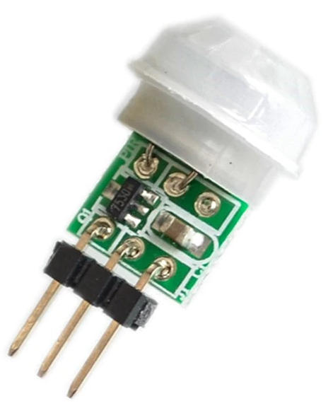
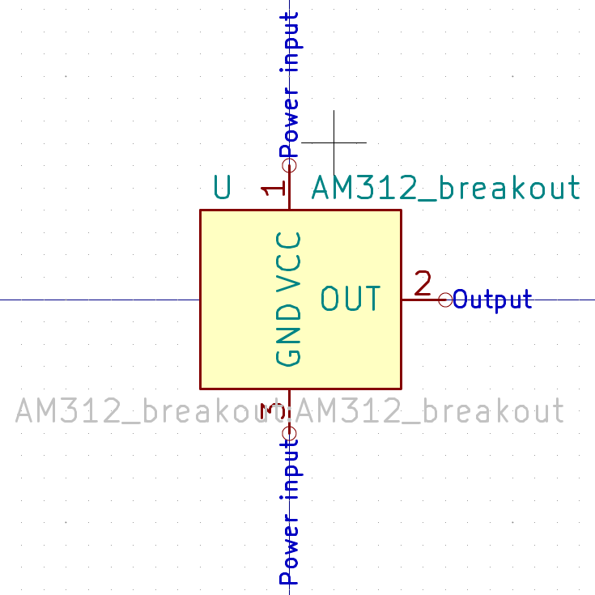
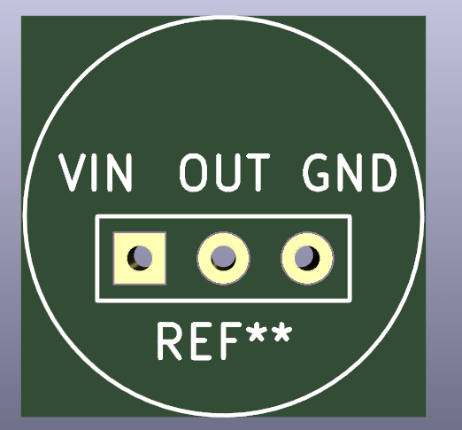
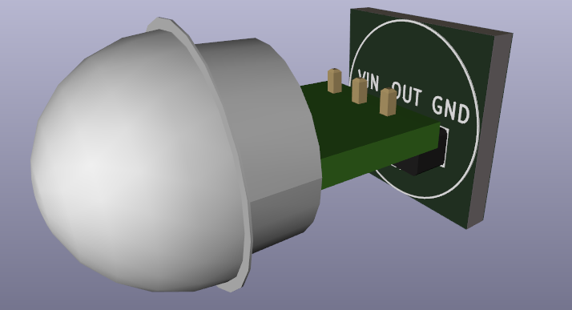
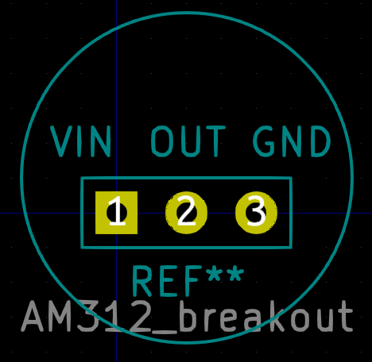

`AHT10` sensor breakout

# Specifications
- [`AHT10`](http://www.aosong.com/en/products-40.html) sensor, `I2C` communication
- Regulator on `VIN` pin (minimum 3.3V, maximum 5V)
- You can change the `I2C` address from `0x38` to `0x39` by moving the resistor on the board

# Buy
https://aliexpress.com/item/4000961263862.html

# Screenshots

## Symbol

## Footprint

