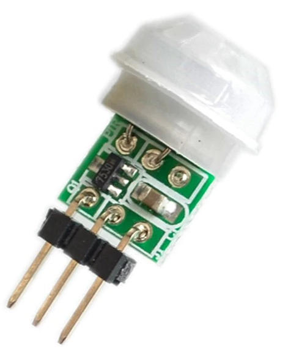
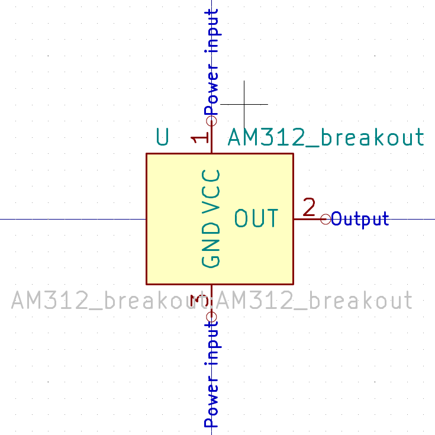
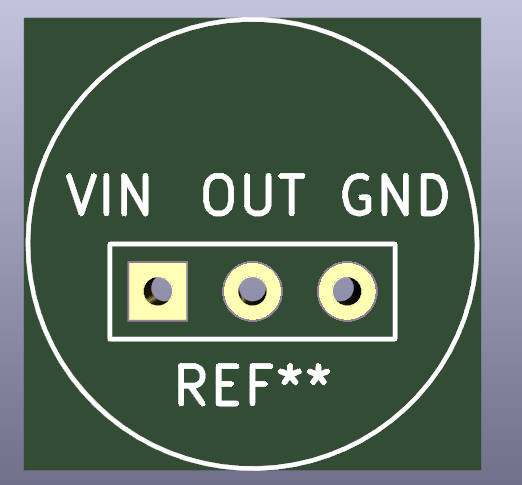
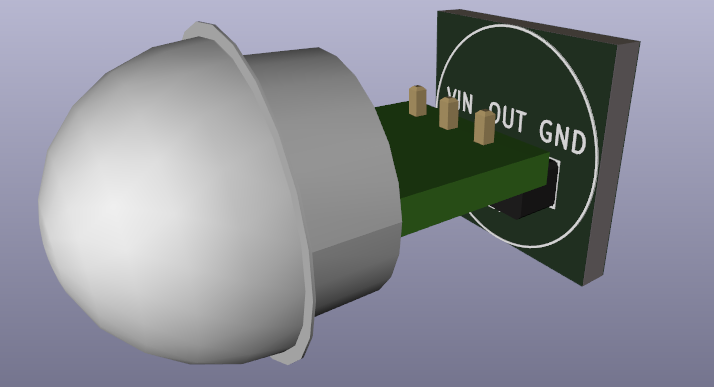
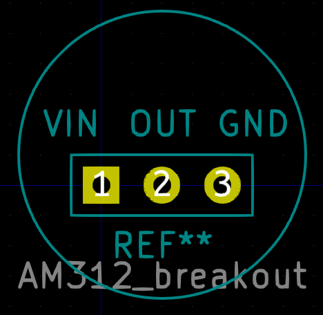

`AM312` sensor breakout

# Specifications
- [`AM312`](http://www.image.micros.com.pl/_dane_techniczne_auto/cz%20am312.pdf) sensor
- Integrated pull-down resistor
- Regulator on `VIN` pin (minimum 2.7V, maximum 12V)

# Buy
https://aliexpress.com/item/32925759356.html

# Screenshots

## Symbol

## Footprint

