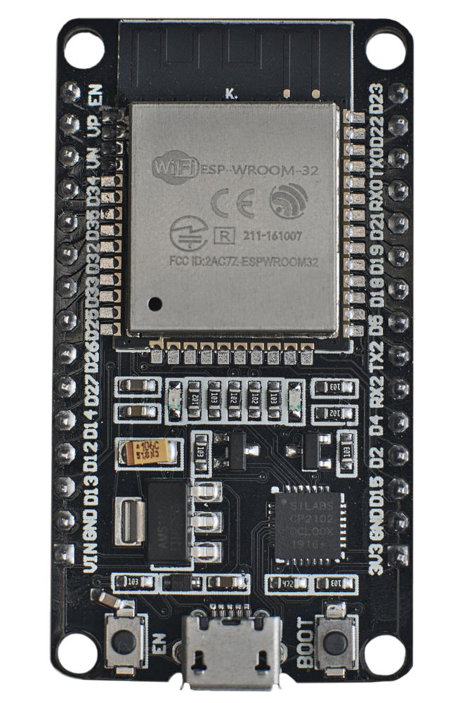
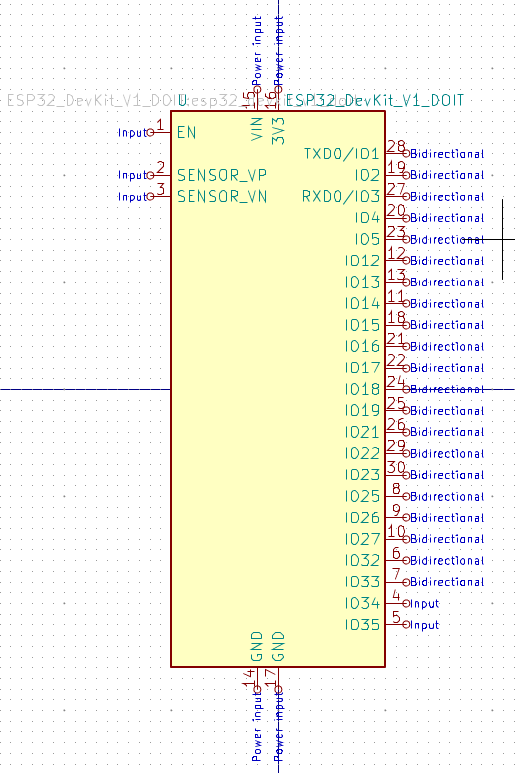
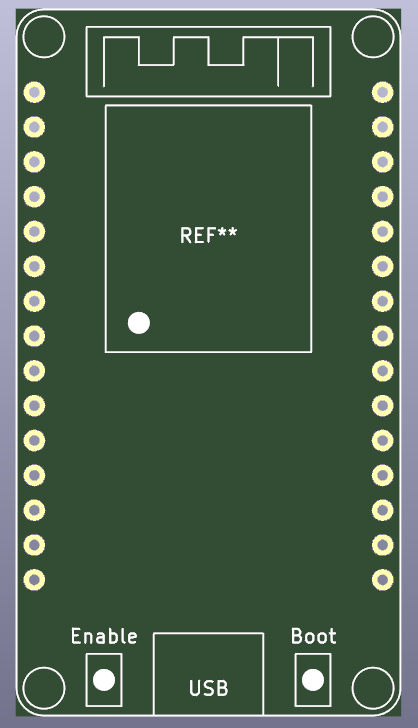
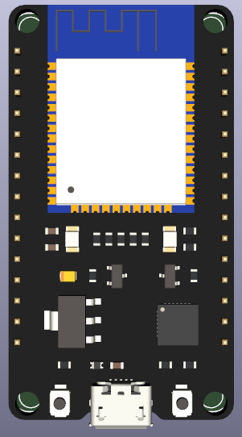
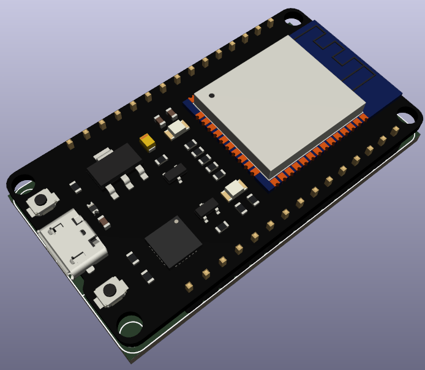
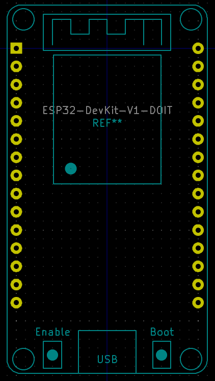

`ESP32 DevKit V1 DOIT`

# Specifications
- ESP-WROOM-32 chip
- 30 pins on the board
- Board size: ~ 28 x 52 mm
- Regulator on `VIN` pin ([AMS1117](http://www.advanced-monolithic.com/pdf/ds1117.pdf): minimum 4.3V, maximum 12V)

# Buy
https://www.aliexpress.com/item/32864722159.html

# Screenshots

## Symbol

## Footprint

