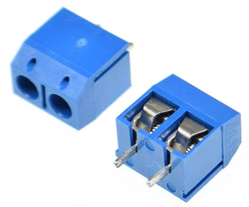
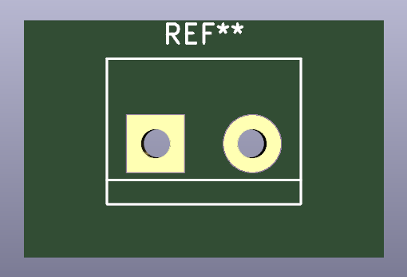
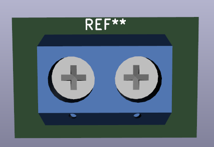
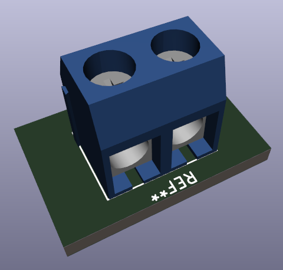
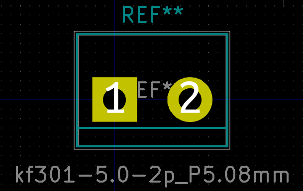

KF301-5.0 2P and 4P terminal block

# Specifications
- Pin pitch: 5.08 mm
- 2 pin and 4 pin version (a 3 pin version exists but it is not included in this repository)

# Buy
https://www.aliexpress.com/item/33008181029.html

# Symbol
Use `Connector:Screw_Terminal_01x02` or `Connector:Screw_Terminal_01x04`

# Screenshots

## Footprint

